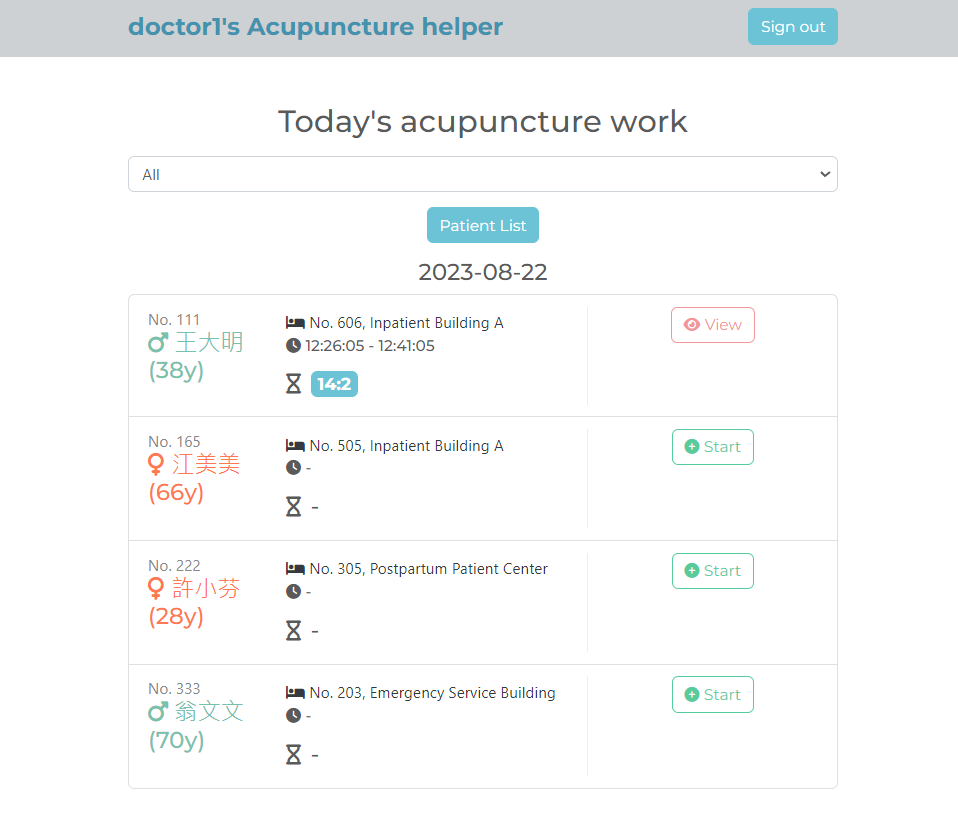

# acupuncture-helper

## 專案呈現畫面



## 功能描述 (features)

- 專案介紹: 進行會診針灸治療時，要到各個病房進行針灸治療，每位患者治療 15 分鐘，再由另一組醫師進行拔針，為了解決以下問題:
  - 一人需攜帶多份紙張資訊，但很多資訊是重複的
  - 過程中除了紙張資訊易掉落遺失，每位病患治療 15 分鐘要靠團隊成員人腦倒數，容易出錯
  - 要確任針灸開始時間跟結束時間，因由兩隊人馬進行治療跟取針，時間的確認用 LINE 做溝通，LINE 蒐尋功能不佳，每個人傳輸的資料很容易被新資料往下推而錯看
  - 因而整合所有上述治療環節，包含: 不需紙張作業、不須人腦倒數每位患者治療時間、不須用 LINE 來核對時間，只需使用 acupuncture-helper 即可
- 使用者註冊:
  - 使用者可透過輸入姓名、Email、密碼、確認密碼進行註冊，所有欗位皆為必填，輸入有錯誤時
    畫面會跳出錯誤提示
- 使用者登入:
  - 使用者可透過 Email、密碼登入才可看見自己的記帳清單
  - 使用者可透過 Facebook 帳號進行登入
  - 輸入有錯誤時畫面會跳出提示
- 登入後:
  - 首頁可一次瀏覽所有當天需治療患者的清單資訊
  - 首頁可用該患者所在醫院大樓位置做篩選
  - 可在每次治療前，點擊 Patient List 新增或刪除下一次要治療患者的清單
  - 可在每次治療前，提前確認患者是否有變換病床位置或其他資訊的變換，事先進行編輯
  - 可瀏覽過往患者針灸治療的紀錄
  - 進行針灸治療的醫師可點擊首頁的 Start 紀錄針灸位置、時間、針數，輸入完成點擊送出後，首頁即會自動從此時開始倒數 15 分鐘
  - 進行取針的醫師可從首頁的倒數器知道患者還有多久需要拔針，當倒數結束顯示 Time's Up 時，點擊首頁 view 即可進入針灸詳細頁，不完針後點擊 complete ，首頁的 Time's Up 即會更新成 Completed

## 安裝與執行步驟 (installation and execution)

- 下載專案到本地端

  ```
  git clone
  ```

- 打開終端機進入到下載的資料夾

  ```
  cd acupuncture-helper
  ```

- 執行指令安裝所需套件

  ```
  npm install
  ```

- 參考 .env.example 的內容，建立 .env 檔，並填入需要的變數

- 新增種子資料

  ```
  npm run seed
  ```

- 安裝完成後，執行 nodemon 啟動專案

  ```
  npm run dev
  ```

  或想直接使用 node 指定啟動專案，可以執行以下指令

  ```
  npm start
  ```

- 看到終端機顯示 "Express is listening on localhost:3000"，即可開啟瀏覽器在網址列輸入 localhost:3000 進入網站

## 環境建置與需求 (prerequisites)

- Node.js: v10.15.0
- express: v4.17.1
- express-handlebars: v5.2.0
- express-session: v1.17.3
- method-override: v3.0.0
- mongoose: v5.10.9
- mongoDB: v4.2.10
- bcryptjs: v2.4.3
- passport: v0.4.1
- passport-facebook: v3.0.0
- passport-local: v1.0.0
- bootstrap: v4.2.1
- font-awesome: v6.3.0
- Bootswatch: v5.2.3
- jQuery: v3.3.1
